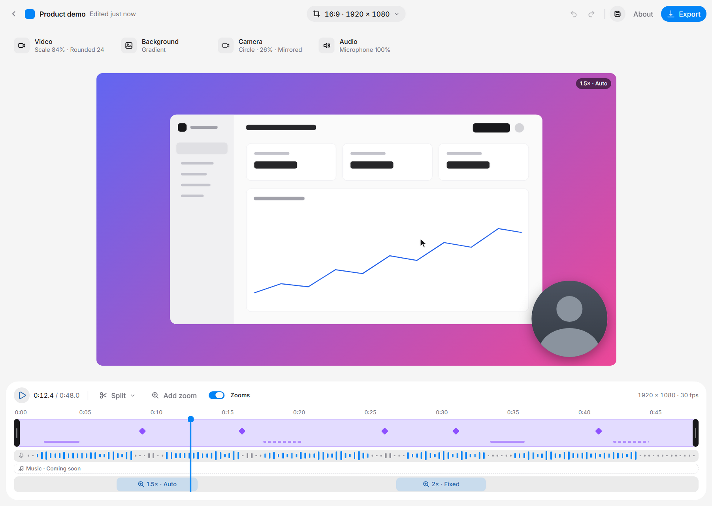
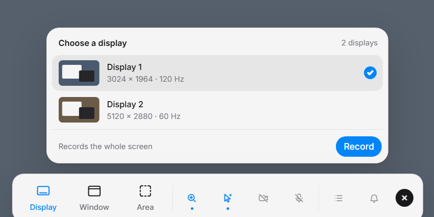
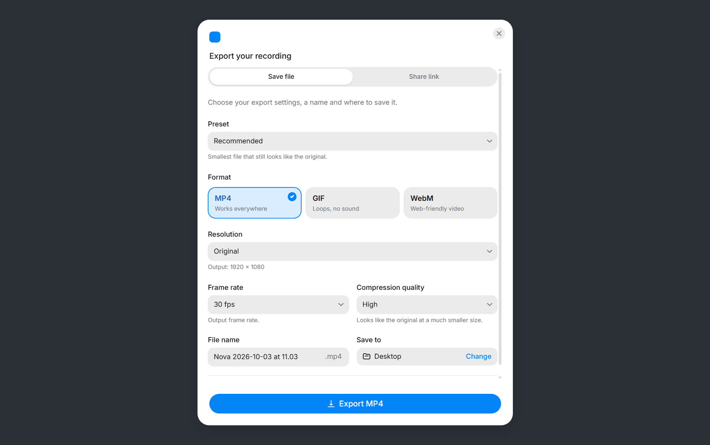
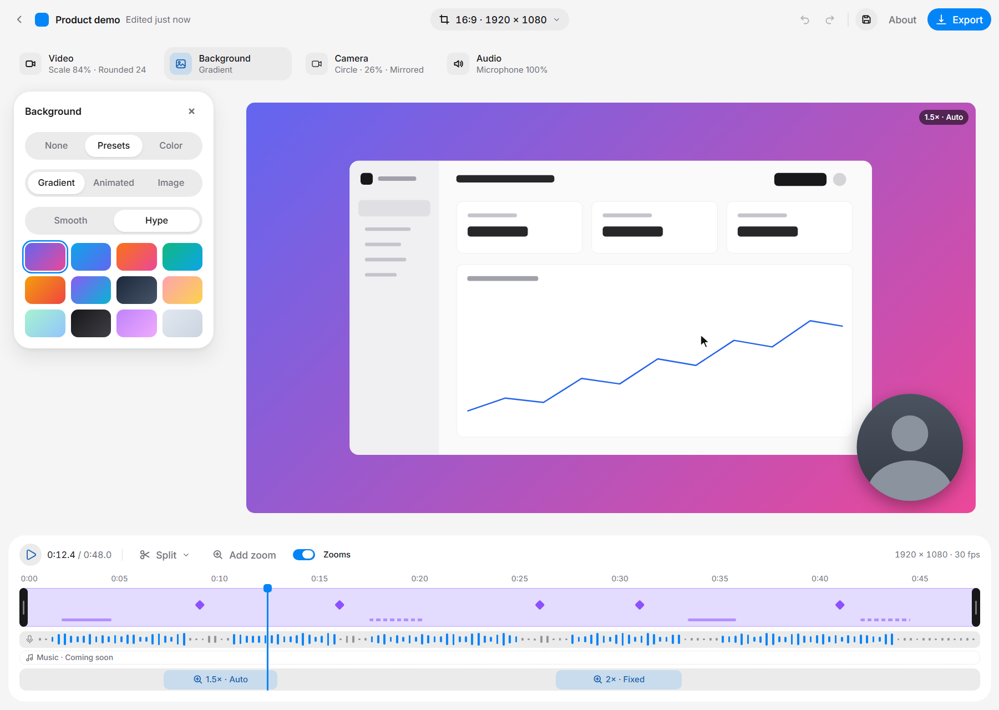
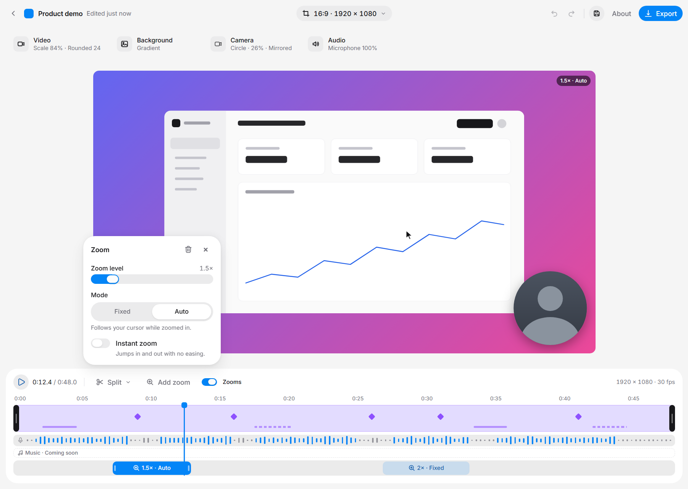

# Nova: free, open-source screen recorder and editor for Windows

Nova records your screen and makes it look edited, automatically. Automatic zoom on clicks, a smooth cursor and beautiful backgrounds turn a plain screen recording into a polished product demo, tutorial or bug report. It is a free, open-source alternative to paid tools like Screen Studio, built for Windows.

**[Download the latest version](https://github.com/jetmirhaxhiavdyli-main/nova/releases/latest)** (Windows 10/11, 64-bit)

## Screenshots



| | |
|---|---|
|  **Record** a display, window or area |  **Export** to MP4, WebM or GIF |
|  **Backgrounds**: gradients, images, animated |  **Zooms** you can edit on the timeline |
## Features

- **Record anything:** a display, a window or a custom area at up to 60 fps, with optional webcam and microphone
- **Automatic zoom:** zooms in where you click and type, with an editable zoom timeline
- **Smooth cursor:** removes shaky mouse movement
- **Beautiful backgrounds:** gradients, images and animated backgrounds, with padding, rounded corners and shadow
- **Simple editor:** trim, split and delete sections, and place your camera bubble anywhere
- **Export:** MP4 (H.264), WebM (VP9) and GIF, with presets, resolution and quality options (ffmpeg)
- **Projects:** save and reopen your recordings
- **Private:** everything stays on your PC. No account, no upload, no telemetry
- **Auto-update:** installed builds update from GitHub Releases

## Install

Download [`Nova-Setup.exe`](https://github.com/jetmirhaxhiavdyli-main/nova/releases/latest/download/Nova-Setup.exe) (always the newest version) and run it. All releases are listed on the [releases page](https://github.com/jetmirhaxhiavdyli-main/nova/releases). The installer is unsigned, so Windows SmartScreen may show a warning: choose **More info → Run anyway**.

Stop a recording with **Ctrl+Shift+X** or the floating Stop button.

## Platform support

Nova is developed and tested on **Windows only**. There is no macOS or Linux build, and no macOS testing has been done.

## Run from source

Requires Node.js 22.12+ and [pnpm](https://pnpm.io).

```
pnpm install
pnpm build
pnpm start
```

`pnpm dev` starts the Vite dev server for the UI only (the browser preview has no capture). Preview states are listed at the top of `src/main.jsx` (`?preview=export`, `?preview=editor`, and so on).

## Build an installer

```
pnpm dist:win
```

The installer is written to `release/<version>/`. `pnpm release:win` also publishes it to GitHub Releases (needs a `GH_TOKEN`); the updater reads the repository set in `package.json` → `build.publish`, so change it if you fork.

## Tests

Most tests run with plain Node: `node --test tests/<file>`. On a machine without Node on the PATH, run them through Electron: `ELECTRON_RUN_AS_NODE=1 node_modules/electron/dist/electron.exe --test tests/<file>`.

## Project layout

- `src/`: React UI (recorder toolbar, pickers, editor, export dialog)
- `electron/`: main process, capture, export (ffmpeg), projects, updater
- `scripts/`: benchmark and validation scripts
- `tests/`: unit tests

Built with Electron, React, [HeroUI](https://www.heroui.com) v3 and Tailwind CSS v4.

## Contributing

Issues and pull requests are welcome. Please open an issue first for larger changes.

## License

Nova is released under the [MIT License](LICENSE). It bundles ffmpeg through `ffmpeg-static`/`ffprobe-static`, which are distributed under their own licenses (the ffmpeg build may be GPL); check them before redistributing installers. The Inter font is under the SIL Open Font License (`src/assets/fonts/Inter-OFL.txt`).
